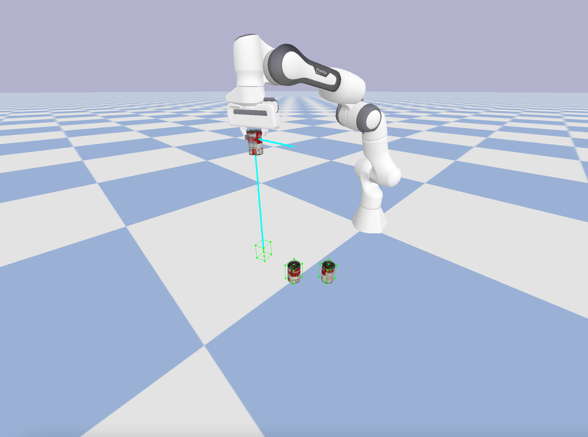
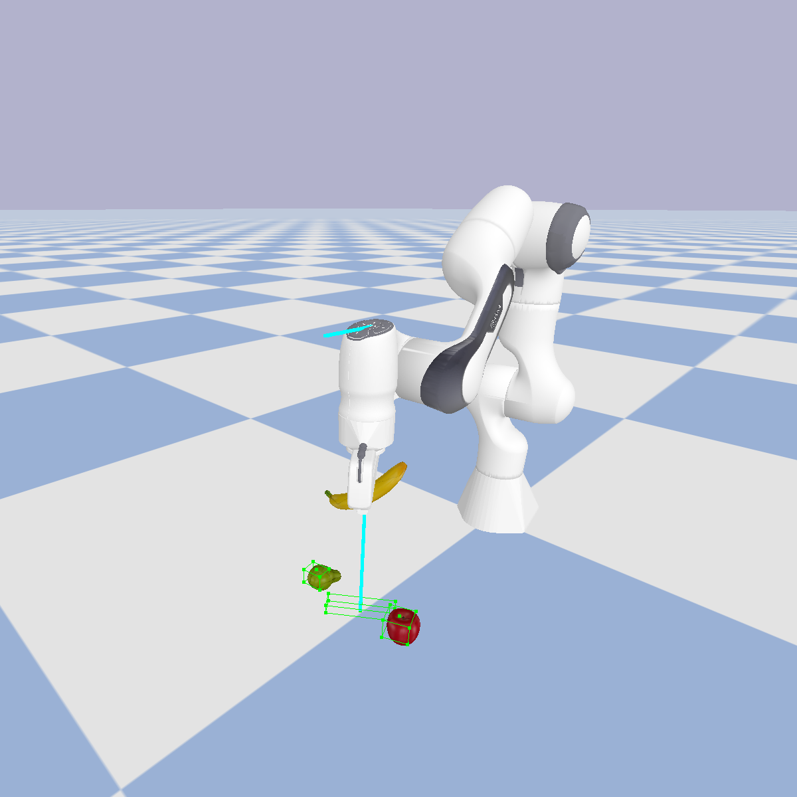
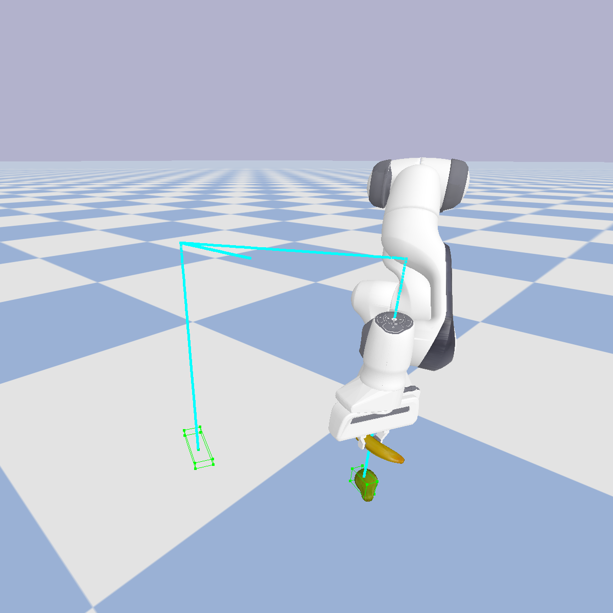
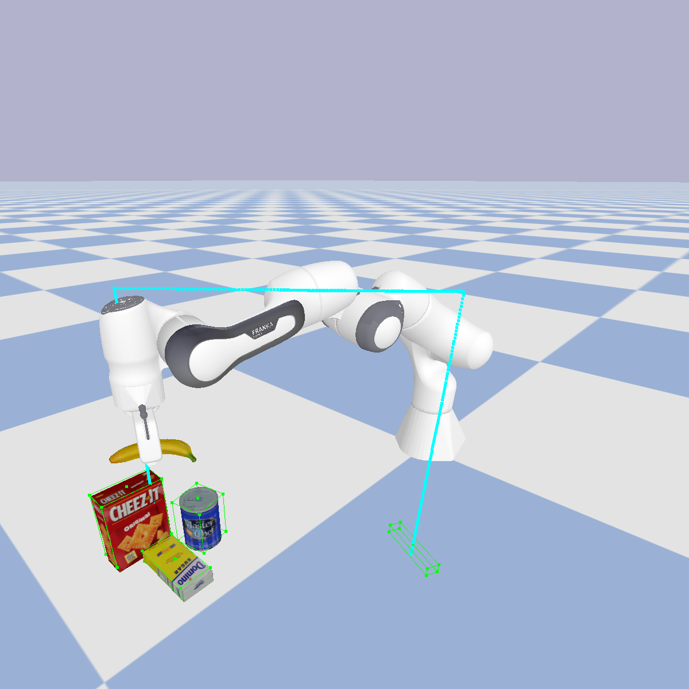
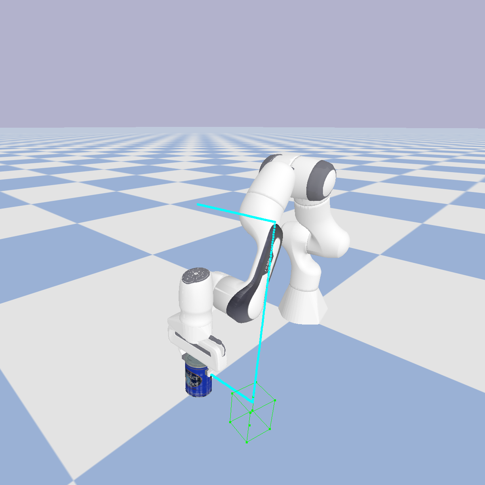
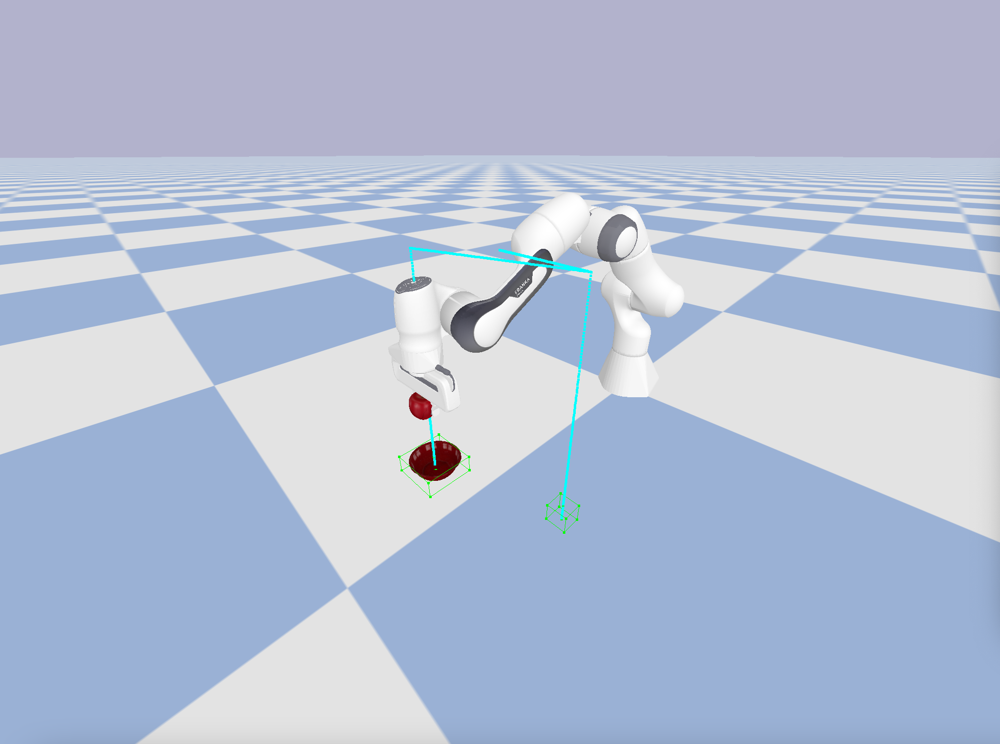
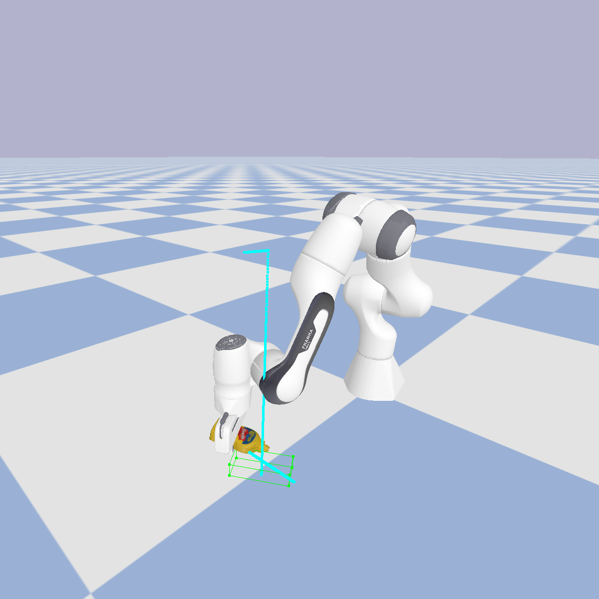
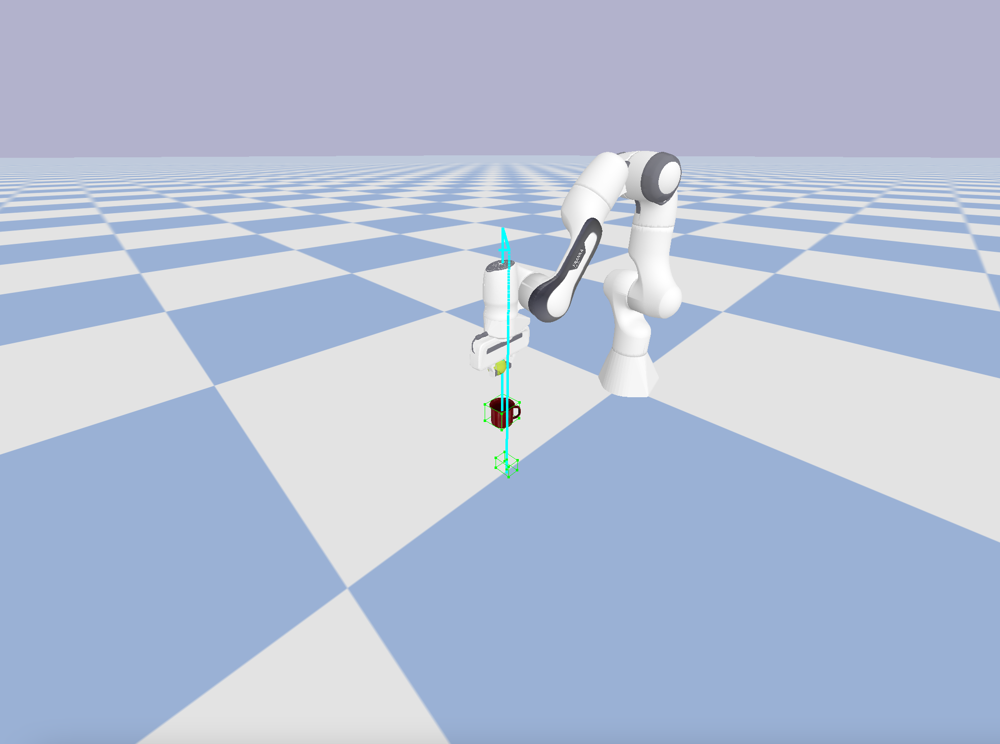

# Language Models as Zero-Shot Trajectory Generators

## Teyun Kwon, Norman Di Palo, Edward Johns

[The Robot Learning Lab](https://www.robot-learning.uk/), Department of Computing, Imperial College London

[📄 arXiv](https://arxiv.org/abs/2310.11604) · [💻 project page](https://www.robot-learning.uk/language-models-trajectory-generators)

<p float="left">
      
      
      
      
</p>
<p float="left">
      
      
      
      
</p>

In this work, we investigate if an LLM (GPT-4) can directly predict a dense sequence of end-effector poses for manipulation skills, when given access to only object detection and segmentation vision models, and without any in-context examples, motion primitives, external trajectory optimisers, or robotics-specific training data, with only a single task-agnostic prompt.

This repository contains the code for running the full system in the PyBullet simulation environment. Note that all the experiments for the paper were performed in the real world, and the code has been adapted to run out of the box in the simulator, so that the results of the task-agnostic prompt can be seen quickly and easily. Nonetheless, it should be relatively simple to change the code to run the system on your own robot in simulation or in the real world.

More information on PyBullet can be found [here](https://pybullet.org/wordpress/). The GitHub page can be found [here](https://github.com/bulletphysics/bullet3). A useful quickstart guide can be found [here](https://docs.google.com/document/d/10sXEhzFRSnvFcl3XxNGhnD4N2SedqwdAvK3dsihxVUA/edit?usp=sharing).

This repository also contains the [full prompts](https://github.com/kwonathan/language-models-trajectory-generators/tree/main/prompts), the [prompts used for the ablation studies](https://github.com/kwonathan/language-models-trajectory-generators/tree/main/ablations), along with [example LLM outputs](https://github.com/kwonathan/language-models-trajectory-generators/tree/main/outputs) for a selection of the tasks.

## Table of Contents

- [🧑‍💻 Getting Started](#-getting-started)
  - [Quick Installation Guide](#quick-installation-guide)
  - [Step-By-Step Installation Guide](#step-by-step-installation-guide)
- [🦾 Running the Code](#-running-the-code)
  - [Setting Your OpenAI API Key](#setting-your-openai-api-key)
  - [Starting the Simulator](#starting-the-simulator)
  - [Adding Other Robots](#adding-other-robots)
  - [Adding Other Objects](#adding-other-objects)
- [🖥 Code Structure](#-code-structure)
- [📚 Citation](#-citation)

## 🧑‍💻 Getting Started

### Quick Installation Guide

The following commands will install everything required to run the full system in the PyBullet simulation environment. If you would like more information on each command, please refer to the [Step-By-Step Installation Guide](#step-by-step-installation-guide).

```
git clone --recurse-submodules https://github.com/kwonathan/language-models-trajectory-generators.git;
cd language-models-trajectory-generators;
pip install -r requirements.txt;
pip install -U git+https://github.com/luca-medeiros/lang-segment-anything.git;
mkdir XMem/saves;
mkdir -p images/trajectory;
wget -P XMem/saves https://github.com/hkchengrex/XMem/releases/download/v1.0/XMem.pth
```

### Step-By-Step Installation Guide

First, clone the repository with the `--recurse-submodules` flag to initialise the XMem submodule:
```
git clone --recurse-submodules https://github.com/kwonathan/language-models-trajectory-generators.git
```
The XMem object tracking model will be used at the end of each task execution for success detection, by obtaining the poses of the relevant objects over the duration of the task execution and providing them to the LLM to determine whether the task was completed successfully or not.

Once the repository has been cloned, navigate to the project directory:
```
cd language-models-trajectory-generators
```

Next, we need to install the required packages:
```
pip install -r requirements.txt
```

Then, we need to install the LangSAM model:
```
pip install -U git+https://github.com/luca-medeiros/lang-segment-anything.git
```
[LangSAM](https://github.com/luca-medeiros/lang-segment-anything) is a language-conditioned object segmentation model based on [Grounding DINO](https://github.com/IDEA-Research/GroundingDINO) and [Segment Anything](https://github.com/facebookresearch/segment-anything). It will be used to detect and segment objects to obtain bounding boxes and provide object poses to the LLM. Note that this is all performed automatically, and no human intervention is required.

Several directories also need to be created. First, create the `XMem/saves` directory for the XMem model:
```
mkdir XMem/saves
```

Then, create the `images` and `images/trajectory` directories:
```
mkdir -p images/trajectory
```
The images generated from running the system will be saved in these directories.

Finally, download the XMem model into the `XMem/saves` directory:
```
wget -P XMem/saves https://github.com/hkchengrex/XMem/releases/download/v1.0/XMem.pth
```

## 🦾 Running the Code

### Setting Your OpenAI API Key

Before running the code, make sure to set your OpenAI API key as an environment variable, or manually set the `openai.api_key` in `main.py`:
```python
openai.api_key = os.getenv("OPENAI_API_KEY")
```

### Starting the Simulator

The following command will start the PyBullet simulator to run the system:
```
python main.py --robot franka
```

The available arguments and their options are as follows:
- `--language_model` or `-lm`: select the language model from `gpt-4`, `gpt-4-32k`, `gpt-3.5-turbo`, or `gpt-3.5-turbo-16k`; default is `gpt-4`. `gpt-4` performs better than `gpt-3.5-turbo`, and `gpt-4-32k` with the longer context length seems to be available only to a small group of beta testers.
- `--robot` or `-r`: select the robot from `sawyer`, or `franka`; default is `sawyer`. Currently, this repository only contains the code to run the system on the `franka` robot. This will be updated with support for the `sawyer` robot in the future.
- `--mode` or `-m`: select the mode to run from `default`, or `debug`; default is `default`. The `debug` mode will start the PyBullet simulator with various debug windows which may be useful for visualisation.

Once the system and the models have been loaded upon starting the simulator, you will see the following prompt:
```
Enter a command:
```

Here, enter a command such as `pick the fruit in the middle`, or `place the apple in the bowl`.

Thereafter, no further human input is required.

After task execution, if the task was completed successfully, you will be able to enter another command. Note that this may result in exceeding the context length limit, as the new command is appended to the previous outputs of the LLM.

### Adding Other Robots

Currently, this repository only contains the code to run the system on the Franka Panda robot. However, the system is robot-agnostic, and you should be able to run it with any other robot arm you load in the simulator.

The Sawyer robot with the 2F-85 Robotiq gripper as used for the experiments in the paper will be added soon.

The Sawyer robot was cloned from [here](https://github.com/erwincoumans/pybullet_robots/tree/master/data/sawyer_robot).
The Franka Panda robot was cloned from [here](https://github.com/bulletphysics/bullet3/tree/master/examples/pybullet/gym/pybullet_data/franka_panda).

Other robots can be loaded in `robot.py` as follows:
```python
self.id = p.loadURDF("path/to/robot.urdf", self.base_start_position, self.base_start_orientation_q, useFixedBase=True)
```

Be sure to set the other attributes in the `Robot` class.

### Adding Other Objects

Currently, there are 5 objects in the repository available to load in the simulator. These objects are [YCB objects](https://www.ycbbenchmarks.com/), but PyBullet should support any URDF object files to be loaded in the simulation environment. If you would like to download more YCB objects, please refer to [this repository](https://github.com/kwonathan/ycb_urdfs), where you will be able to download the entire YCB object model set or build a subset of the object model set from scratch.

Make sure to have both the URDF files and the object asset files in the repository for the objects to load properly.

By default, the `002_master_chef_can` will be loaded in the environment.

If you would like to load more objects in the environment, you can modify the `config.py` file to define the object poses (see the `object_start_position` and `object_start_orientation_e` variables for the `002_master_chef_can` as an example). So, in the `config.py` file, you can add the following:
```python
# In the config.py file:
object2_start_position = [0.1, 0.5, 0.2]
object2_start_orientation_e = [0.0, 0.0, 0.0]
```

The objects are then loaded in the `Environment` class in the `env.py` file, using the `loadURDF` function. So, in the `env.py` file, you can add the following:
```python
# In the env.py file:
object2_start_position = config.object2_start_position
object2_start_orientation_q = p.getQuaternionFromEuler(config.object2_start_orientation_e)
object2_model = p.loadURDF("ycb_assets/003_cracker_box.urdf", object2_start_position, object2_start_orientation_q, useFixedBase=False, globalScaling=config.global_scaling)
```

## 🖥 Code Structure

The full system will run in two processes, so that both planning and execution can be performed simultaneously for faster task completion, and so that it is possible to interact with the simulation environment during LLM inference.

Firstly, the main process (`MainProcess`) will handle the main logic of the system, such as calling the LLM to predict the trajectory of end-effector poses, and calculating the poses of the relevant objects to provide to the LLM to determine whether the task was completed successfully or not. It will also execute available robot-agnostic API functions such as `detect_object` and `execute_trajectory`, and if they require interaction with the simulation environment, the relevant data will be exchanged with the environment process.

The environment process (`EnvProcess`) will handle the different events called by the main process in the simulation environment. These include actuating the gripper, executing a trajectory in the environment, or capturing images for object detection or task success detection.

Further, it should facilitate adapting this codebase to allow the system to run on a real robot, as the `api.py` and `main.py` files can be kept largely the same, and only the `env.py` and `robot.py` files would need to be changed for use in the real world.

## 📚 Citation

Please consider citing our work if you found it useful!
```bibtex
@misc{kwon2023language,
      title={Language Models as Zero-Shot Trajectory Generators}, 
      author={Teyun Kwon and Norman Di Palo and Edward Johns},
      year={2023},
      eprint={2310.11604},
      archivePrefix={arXiv},
      primaryClass={cs.RO}
}
```
